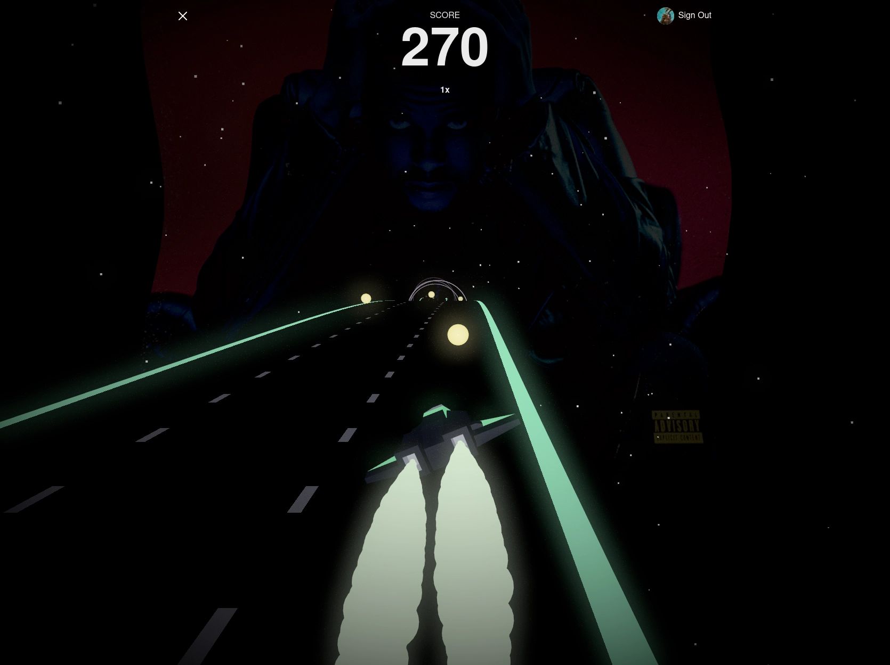

    
  <h3 align="center">next-audio-game</h3>
 

  <a href="https://streamable.com/1a5mx3"><strong>Demo video »</strong></a>
  

This game was made with the ambition of getting more familiar with 3D content on the web. The game itself draws inspiration from the classic game [AudioSurf](https://store.steampowered.com/app/12900/AudioSurf/).

A Spotify Premium subscription is required to play the game.

## Technologies
* Next.js 12
* NextAuth.js
* react-three-fiber
* glsl shaders
* Spotify API
* Chakra UI

## Getting Started

1. Clone the project
2. Create a `.env.local` file in the root of the project. Instructions can be found in [.env.example](.env.example)
3. Install dependencies by running `yarn`
4. Start the game by running `yarn dev`

## Screenshot

## Controls
Change lane with A,S,D or :arrow_left: :arrow_down: :arrow_right:

## Contributing

Contributions are more than welcome!

## Attributions

This project was bootstrapped with [create-r3f-app](https://github.com/RenaudROHLINGER/create-r3f-app)

Road shader by Daniel Velasquez via [tympanus](https://tympanus.net/codrops/2019/11/13/high-speed-light-trails-in-three-js/)

Space Craft Speeder by Kenney [CC0](https://creativecommons.org/publicdomain/zero/1.0/) via [Poly Pizza](https://poly.pizza/m/mlQBUQRUpM)
